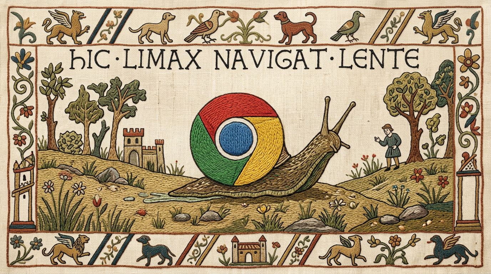

# faster-chrome-devtools-skill

An agent skill and command-line tool for controlling Chrome directly through the
Chrome DevTools Protocol (CDP).

It uses a WebSocket connection from Node.js to Chrome, so you do not need Chrome
DevTools MCP, Puppeteer, or Playwright.



## Install

```sh
npx skills add zeke/faster-chrome-devtools-skill --global --all --yes
```

Node.js 22 or later is required. For local browser access, enable remote
debugging in Chrome at `chrome://inspect/#remote-debugging`.

## Capabilities

- List, open, and reuse tabs
- Read compact accessibility snapshots with stable element references
- Click and fill by accessibility reference or CSS selector
- Navigate with explicit timeouts
- Wait for text or selectors without arbitrary sleeps
- Type into focused cross-origin frames using native CDP input
- Capture compressed JPEG/WebP screenshots by default
- Inspect console messages and failed network loads
- Evaluate JavaScript or invoke any raw CDP method
- Connect to authenticated remote browser endpoints
- Keep the connection alive in a lightweight background daemon

Run `node scripts/cdp.mjs --help` for the complete command reference. Agent usage
patterns, screenshot safety, debugging guidance, and remote-browser notes live in
[`SKILL.md`](SKILL.md).

## Try it

Once installed, ask your coding agent to drive Chrome. Paste a prompt like this
into your agent:

```text
Take a screenshot of https://example.com and describe what is on the page.
```

The agent loads this skill and runs the bundled CLI for you. You can also run the
CLI directly:

```sh
node scripts/cdp.mjs list
node scripts/cdp.mjs snapshot <target>
node scripts/cdp.mjs screenshot <target> /tmp/page.jpg
```

The CLI automatically discovers Chrome on macOS, Windows, and common Linux
installations. Explicit local or remote endpoints are also supported:

```sh
node scripts/cdp.mjs --http-endpoint http://127.0.0.1:9222 list
node scripts/cdp.mjs --ws-endpoint 'wss://example.test/devtools/browser/...' list
```

Authenticated endpoints can receive arbitrary upgrade headers:

```sh
export CDP_WS_ENDPOINT='wss://example.test/devtools/browser/...'
export CDP_HEADERS='{"Authorization":"Bearer ..."}'
node scripts/cdp.mjs list
```

## Design

The CLI is implemented entirely with Node.js built-ins. `scripts/lib/websocket.mjs`
contains the small RFC 6455 client used to support custom HTTP upgrade headers,
which Node's browser-compatible global `WebSocket` API does not expose.

A loopback-only background daemon holds the CDP connection open for 20 minutes.
Its random authentication token and connection details are stored in an
owner-readable temporary state file. This avoids repeated Chrome access prompts
without exposing the daemon on the network.

Stop the sole active daemon with `node scripts/cdp.mjs stop`. If several are
running, the CLI lists safe daemon IDs and requires `stop --id <id>` or the
explicit `stop --all`. An endpoint-specific stop can be selected with
`--ws-endpoint` or `--http-endpoint`; cleanup never needs to reconnect to or
rediscover the browser.

## Development

```sh
node --test
node --check scripts/cdp.mjs
node --check scripts/lib/websocket.mjs
```

The test suite has no external dependencies and does not require Chrome.

## License

MIT
